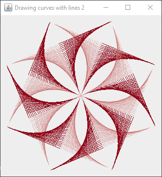
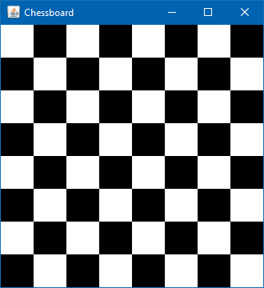
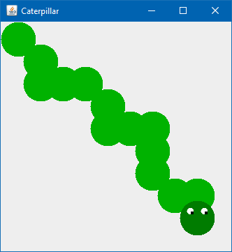

# Java Swing Demos: Drawing curves with lines, Chessboard and Caterpillar

This project contains four Java Swing Demos that use drawLine, fillRect
and fillOval in order to draw the figures described by the practice’s
specifications. Each demo corresponds to one of the practice’s
exercises.

It uses some custom tools in order to make drawing using mathematical
transformations easier. All the demos inherit from an abstract subclass
of `JPanel` (`Demo`) which implements a method that returns an
`ImmutablePoint2D` object that contains the coordinates of the center of
the panel.

The `Demo` class also provides the specification of the method
`getOrigin()` which provides each demo a way to customize the desired
cartesian coordinate origin it should work with.

## Drawing curves with lines

Creating the impression of curved lines using only straight sections
relies on carefully translating the end points of the lines through each
iteration. On the first quadrant and supposing the first line extends
upwards from the origin, the shift that helps us simulate this effect
corresponds to the following operations:

  - Move the start point `delta` units to the right.
  - Move the end point `delta` units down.

where `delta` is calculated by dividing the length of the axes by the
number of lines to be used. The results of this transformation

The first and second exercises heavily relied on the `ImmutablePoint2D`
class in order to navigate and draw the lines.

This is a simplified explanation of the drawing process:

1.  First create a baseline.
2.  Then rotate it around the quadrant’s center several times depending
    on the requirements
3.  Finally the resulting figure is rotated around the panel’s center to
    produce the desired figure.

## Chessboard

Using an `ImmutablePoint2D` to hold the coordinates of the top/left
corners of the squares, we created the chessboard by continuously
translating said point seven times to the right before translating it
downwards to draw the next row, for a total of 8 squares in each of the
8 rows.

## Caterpillar

Lastly, the last demo draws connecting ovals that represent a
caterpillar, the caterpillar always stays within the panel and it
changes when the window is resized.

## Building and running the program

The program can be built using gradle, the most common tasks are
described bellow, for a full list of available tasks use `./gradlew
tasks`. If you’re on Linux or Mac then running the following command
from the project’s main directory will be enough to build and run the
program: `./gradlew run`. If you’re on windows use `gradlew.bat run`
instead.

Some of the most common tasks are:

1.  `./gradlew build`, compiles and creates the outputs of this project.
2.  `./gradlew javadoc`, generates the program’s documentation and puts
    it inside `doc/`.
3.  `./gradlew run`, builds the program and runs the application.
4.  `./gradlew clean`, deletes all files and folders generated during
    the build process (except the .gradle directory).

## Acknowledgements

For more information on the tools used to build, create and run this
program refer to the following links:

  - [Gradle](https://gradle.org/) was used to create the build script.
  - [JetBrains’ IntelliJ IDEA](https://www.jetbrains.com/idea/) was used
    as the primary editor.
